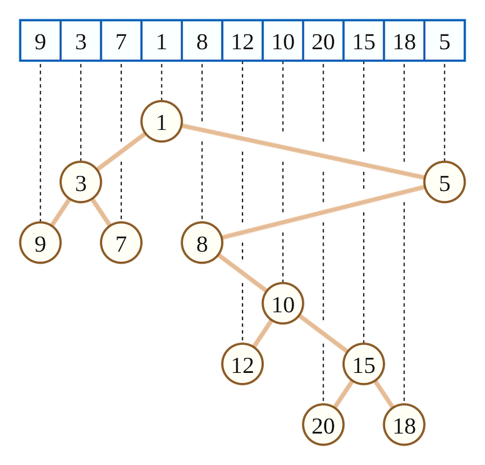

export {default as theme} from './theme'
import { Image, Appear } from 'mdx-deck'
import { Split } from 'mdx-deck/layouts'
import Separator from './components/Separator'

<Separator src="images/sections/landfill.png" title="garbage collection" />

---

### automatic memory management

* allocate space for new objects
* identify live objects
* reclaim the space occupied by dead objects

---

<Separator src="./images/sections/cart.jpg" title="history" />

---

### memory allocation

 * static
 * automatic
 * dynamic

---

### static memory allocation

* memory is allocated when the program starts
* the size is fixed
* its lifetime is the entire run of the program

```javascript
static int value;
```

---

### automatic memory allocation

* memory is allocated when the block is entered
* memory is freed when that block is exited

```javascript
int sum(int num1, int num2) {
  return num1 + num2;
}
```

---

### dynamic memory allocation

* allows the size to be determined at run time
* the lifetime is determined by the programmer

```javascript
int main() {
  //do stuff
  int* mem = malloc(1024);
  //more stuff
}
```

---

### explicit deallocation

* dangling pointer
* memory leak

```javascript
int main() {
  //do stuff
  int* mem = malloc(1024);
  //more stuff
  free(mem)
  //even more stuff
}
```
```notes
dangling: memory is freed prematurely
memory leak: the programmer may fail to free an object no longer required by the program
```

---

### garbage collection

* created in 1959 for Lisp
* mark-sweep


---

<Separator src="./images/sections/shopping.jpg" title="allocation" />

---

### strategies

* secuential allocation
* free-list allocation

---

### secuential allocation

* uses a large free chunk of memory with free and a limit pointers
* bump the pointer allocation

---

### free-list allocation

* a data structure records the location and size of free cells of memory
* policies: first-fit, next-fit and best-fit


---

### first-fit

* uses the first cell it finds that can satisfy the request
* if the object is smaller than the cell, splits the cell and returns the remainder to list
* small remainder cells accumulate near the front of the list, slowing down allocations

---

### next-fit
* similar to first-fit
* starts from the point in the list where the last search succeeded
* reduce the need to iterate repeatedly past the small cells at the head of the list
* poor locality

---

### best-fit

* finds the cell whose size most closely matches the request
* avoids splitting large cells unnecessarily
* gives relatively low wasted space in spite of its bad worst-case performance

---

### improving efficiency

* binary tree
* segregated-fits allocation

---

### red-black tree


```notes
for best-fit a red-black tree could be used. It's a self
balancing tree, sorted by size.
```

---

### cartesian tree



```notes
It's a balancing tree based in a sequence, in order traversal
results in the original sequence.
A node in the Cartesian tree must record the address and size of the free cell,
the pointers to the left and right child, and the maximum of the sizes of all
cells in its subtree.
```

---

### segregated-fits allocation

* uses multiple free-lists whose members are segregated by size
* when it splits a cell, the remainder is included in a smaller list

---

<Separator src="./images/sections/schemes.jpg" title="GC schemes" />

---

### schemes

* reference counting
* mark-sweep
* mark-compact
* copying

```notes
Collectors may combine some of this approaches,
for example they could use different methods
in different regions of the heap.
```

---

<Separator src="./images/sections/classification.jpeg" title="reference counting" />

---

### reference counting


---

### reference counting

* memory management costs are distributed throughout the computation
* the memory can be immediately reclaimed
* it may continue to operate satisfactorily in a nearly full heap
* atomic actions
* overhead on the mutator
* circular structures

```notes
the reference count manipulations and the pointer load or store
must be a single atomic action in order to prevent races between
mutator threads which would risk premature reclamation of objects.
```

---

### improving efficiency

* deferral
* coalescing

---

### deferred reference counting

* the majority of stores are made into local variables, which are kept on the stack
* checks references stored in heap objects only
* uses a zero count table (ZCT)

```notes
Objects cannot be reclaimed as soon as their reference count
becomes zero, because there might still be references to them
from the stack.

Periodically the stack is scanned, and any objects in the ZCT
which were not referenced from the stack are reclaimed.
```

---

### coalesced reference counting

* a log is used to store modifications
* mutation events are coalesced if they generate only a single mutation event
* several states of the object are coalesced to just two


---

### circular structures

* the GC combines reference counting with occasional backup tracing collection (trial deletion)

```notes
Partial tracing algorithms take advantage of these observations
by tracing the subgraph rooted at an object suspected of being
garbage. These algorithms trial-delete each reference encountered
by temporarily decrementing reference counts, in effect removing
the contribution of these internal pointers. If the reference
count of any object remains non-zero, it must be because there is
a pointer to the object from outside the subgraph, and hence
neither the object nor its transitive closure is garbage.
```

---

### trial deletion


---

<Separator src="./images/sections/cartoneros3.jpg" title="tracing garbage collectors" />

---

### tracing garbage collectors

* live objects can be found by iteratively tracing all references and subsequent references from mutator roots
* handle circular structures

```notes
After an initial live set has been identified, the tracing
collector follows references from these objects and queues
them up to be marked as live and subsequently have their
references traced. Once the tracing collector has found all
live objects, it will reclaim the remaining memory.

Roots examples in Java: local and static variables, active threads, JNI references.
```

---

### tricolour abstraction

* partitions the object graph into black (presumed live) and white (possibly dead) objects
* when a node is first encountered during tracing it is coloured grey until scanned
* at the end of each iteration of the marking loop, there are no references from black to white objects

```notes
when it has been scanned and its children identified, it is shaded black
```
---

### tricolour abstraction


---

### concurrency


---

### invariants

* weak invariant: white objects pointed to by a black object are grey protected
* strong invariant: there are no pointers from black objects to white objects

---

```javascript
    // Steele (1975)
    atomic Write(src, i, ref):
      src[i] ← ref
      if isBlack(src)
        if isWhite(ref)
          revert(src)
```
```notes
it uses an incremental update technique. When adding
a reference to a black object, greys the object if the
reference is white.
```
---

```javascript
    // Appel (1988)
    atomic Read(src, i):
      if isGrey(src)
        scan(src)
      return src[i]
```
```notes
It uses an incremental update technique. It scans the reference when
reading from a grey object.
```

---

```javascript
    // Abraham and Patel (1987) and Yuasa (1990)
    atomic Write(src, i, ref):
      if isGrey(src) || isWhite(src)
        shade(src[i])
      src[i] ← ref
```

```notes
It is a deletion barrier, uses a snapshot-at-the-beginning technique.
```

---

<Separator src="./images/sections/sweep.jpg" title="mark-sweep garbage collectors" />

---

### marking
* the collector traverses the graph of objects, starting from the roots
* sets the mark in the header or a bitmap

```notes
Space for a mark bit can usually be found in an object header word.
Alternatively, mark bits can be stored in a separate bitmap table
to the side of the heap, with a bit associated with every address
at which an object might be allocated.
```

---

### sweeping

* the collector sweeps the heap linearly
* frees unmarked nodes
* resets the mark bits of marked nodes

```notes
The complexity of the mark phase is O(L), where L is the size of
the live data in the heap; the complexity of the sweep phase is
O(H) where H is the size of the heap.
Chasing pointers in the mark phase leads to unpredictable memory
access patterns, whereas sweep behaviour is more predictable.
Further, the cost of sweeping an object tends to be much less than
the cost of tracing it.
```

---

### parallel marking

* thread-local work list
* idle threads adquire work from a global list or from another thread's stealable work queue

```notes
  No synchronisation is necessary to acquire an object to trace if
  the work list is thread-local and non-empty. Otherwise the thread
  must acquire work (one or more objects) atomically, either from
  some other thread’s work list or from some global list.
```

---

### parallel sweeping

* partition the heap into contiguous blocks
* lazy sweeping

```notes
partition: the effect of such a simple strategy is likely to be
that the free-list becomes a bottleneck, sequentialising the
collection.
lazy sweep: in a segregated-fits allocation context, the phase just identify
completely empty blocks and return them to the block allocator.
Partially full blocks are add to local reclaim lists for subsequent
lazy sweeping by mutator threads.
```

---

### mark-sweep cons

* fragmentation
* don't allow fast, sequential allocation

---

<Separator src="./images/sections/compact.jpg" title="mark-compact garbage collectors" />

---

### phases

* mark
* at least one compacting phase

---

### object rearrangement

* **arbitrary**: are simple to implement and fast to execute, but lead to poor spatial locality
* **linearising**: objects are relocated so that they are adjacent to related objects, such as ones to which they refer, which refer to them
* **sliding**: objects are slid to one end of the heap, squeezing out garbage, thereby maintaining their original allocation order in the heap.

---

### two finger algorithm

* uses two pointers: scan and free


```notes
given the volume of live data in the region to be compacted, we know
where the high-water mark of the region will be after compaction.
Live objects above this threshold are moved into gaps below the threshold
The first pass repeatedly advances the free pointer until it finds a gap
(an unmarked object) in the heap, and retreats the scan pointer until it
finds a live object. If the free and scan fingers pass each other, the phase
is complete.
```

---

### two finger algorithm

* best suited to regions containing objects of a fixed size
* awful locality

---

### lisp 2


```notes
procedure moves two ‘fingers’ through the heap: scan iterates through each
object (live or dead) in the source region, and free points to the next free
location in the destination region. If the object discovered by scan is live,
it will (eventually) be moved to the location pointed to by free so free is
written into its forwardingAddress field, and is then incremented by the size
of the object (plus any alignment padding). If the object is dead, it is ignored.
```

---

### lisp 2

* computes the location to which each live object will be moved
* updates references in marked objects
* moves each live object to its new destination

---

### flood et al


---

### flood et al

* parallel
* one region per thread
* alternates the direction in which slides live objects

---

<Separator src="./images/sections/copy.jpg" title="copying garbage collectors" />

---

### copying garbage collectors

* divide the heap in two semispaces: fromspace and tospace
* eliminate fragmentation
* bump the pointer allocation

```notes
In a stop-the-world implementation, the larger the area you need to copy, the
higher the impact on your application performance will be.
In older implementations of this algorithm the from-space and to-space switch
places, meaning that when the to-space is full, garbage collection is triggered
again and the to-space becomes the from-space. Modern implementations of the copying
algorithm allow for arbitrary address spaces within the heap to be assigned as
to-space and from-space. In these cases they do not necessarily have to switch
location with each other; rather, each becomes another address space
within the heap.
```

---

### traversal order


---

### Cheney algorithm


---

### Cheney algorithm

* roots are copied to the new space
* uses two pointers: scan and free
* scans the objects between those pointers and copies every object referenced
* the collection is complete when the scan pointer catches up with the free pointer
* breadth-first copying affects locality

---

### Moon algorithm


```notes
The primary scan pointer is always in the same block as the free pointer.
If the free pointer reaches the next block the primary scan pointer advances
to the start of that block. If the primary scan pointer catches up with the
free pointer, starts scanning from the secondary scan pointer, until the
primary scan pointer points to gray objects again. If the secondary scan
pointer catches up with the free pointer as well, GC is complete.
```

---

### Moon algorithm

* the to-space is divided in blocks
* maintains two scan pointers
* hierarchical decomposition
* may scan objects twice with the secondary scan pointer

```notes
Hierarchical decomposition improves layout of objects in the heap
```

---

### Halstead algorithm


---


### Halstead algorithm

* parallel copying
* creates to-space blocks for each processor
* threads compete only when copying or creating forwarding pointers
* poor load balancing
* breadth-first order

---

<Separator src="./images/sections/trash-cans.jpg" title="comparing GCs" />

---

### comparing GCs
* throughput
* pause time
* space
* scalability and portability

```notes
scalability: it is becoming increasingly important that garbage collection can
take advantage of the parallel hardware on offer.
A number of collection algorithms depend on support from the operating
system or hardware (for instance, by protecting pages or by double mapping
virtual memory space, or on the availability of certain atomic operations
on the processor). Such techniques are not necessarily portable.
```

---

<Separator src="./images/sections/partitioning.jpg" title="partitioning the heap" />

---

### generational garbage collection

* weak generational hypothesis: most objects die young
* segregate objects by age into generations, typically physically distinct areas of the heap
* younger generations are collected in preference to older ones
* survivor objects are promoted to older generation

---

### generations

* two or more generations
* segregated physically or logically
* promotion can be delayed by structuring a generation into two or more aging space

---

### intergenerational pointers

* uses remembered sets to record the location of pointers
* acts as a root for other generation collectors
* allows a moving collector to updste source field with the new address of a promoted object


---


