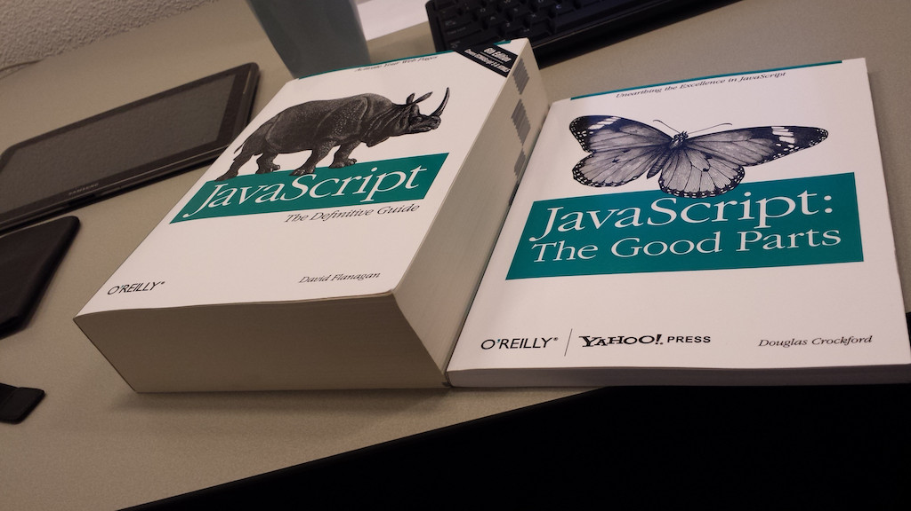

export {default as theme} from './theme'
import { Image, Appear } from 'mdx-deck'
import { Split } from 'mdx-deck/layouts'
import { CodeSurfer } from "mdx-deck-code-surfer"

---
# Javascript :shit:

---

<CodeSurfer
  title="WTF!?"
  code={require("!raw-loader!./snippets/wtf.js")}
  lang="javascript"
  steps={[
    { notes: ""},
    { lines: [1,2], notes: "Comparison operators?" },
    { lines: [4,5], notes: "Operator overloading?" },
    { lines: [7,8], notes: "Long, Double?" },
    { lines: [10], notes: "Type system?" },
    { range: [12,15], notes: "Syntax?" },
    { range: [17,26], notes: "'this' reference?" },
    { range: [27,29], notes: "first class functions?" }
  ]}
/>

---

export default Split

### the good parts

---

<CodeSurfer
  title="type coercion"
  code={require("!raw-loader!./snippets/type_coercion.js")}
  lang="javascript"
  steps={[
    {notes: ""},
    { lines: [1,2], notes: "explicit" },
    { range: [4,8], notes: "implicit" }
  ]}
/>

---
<CodeSurfer
  title="strict equality operator"
  code={require("!raw-loader!./snippets/strict_equality.js")}
  lang="javascript"
  steps={[
    { lines: [1,2], notes: "equality operators" },
    { range: [4,10], notes: "🐲" }
  ]}
/>
---
<CodeSurfer
  title="numbers"
  code={require("!raw-loader!./snippets/numbers.js")}
  lang="javascript"
  steps={[
    { lines: [1], notes: "double precision floating point numbers (64 bits)" },
    { lines: [3,4], notes: "" },
    { lines: [3,4], notes: "Significand precision: 2^53" },
    { lines: [5], notes: "alternatives: decimal.js" }
  ]}
/>

---

---

---

---

---

### functional programming
<ul  style={{textAlign: 'left'}}>
    <li>immutability</li>
    <li>pure functions</li>
    <li>higher-order functions</li>
</ul>

---

# immutability

---

### variable declaration
<ul  style={{textAlign: 'left'}}>
    <li>var</li>
    <li>let</li>
    <li>const</li>
</ul>

---
### variable lifecycle
<ul  style={{textAlign: 'left'}}>
    <li>declaration</li>
    <li>initialization</li>
    <li>assignment</li>
</ul>

---

<CodeSurfer
  title="var"
  code={require("!raw-loader!./snippets/var.js")}
  lang="javascript"
  steps={[
    { notes: ""},
    { lines: [1], notes: "error" },
    { lines: [2,3], notes: "hoisting: declared and initialized" },
    { lines: [3,4], notes: "assigned" },
    { lines: [3,5,6], notes: "mutation" },
    { range: [9,12], notes: "function scope" }
  ]}
/>

---

<CodeSurfer
  title="let"
  code={require("!raw-loader!./snippets/let.js")}
  lang="javascript"
  steps={[
    { notes: ""},
    { lines: [1,2], notes: "declared (hoisting) but not initialized" },
    { lines: [2,3], notes: "initialized" },
    { lines: [2,4,5], notes: "assigned" },
    { lines: [4,6,7], notes: "mutation" },
    { range: [9,13], notes: "hoisting example" },
    { range: [15,18], notes: "block scope" }
  ]}
/>

---

<CodeSurfer
  title="const"
  code={require("!raw-loader!./snippets/const.js")}
  lang="javascript"
  steps={[
    { notes: ""},
    { lines: [1], notes: "not declared" },
    { lines: [2], notes: "not initialized" },
    { lines: [3,4], notes: "declared, initialized and assigned" },
    { lines: [3,5,6], notes: "immutable" },
    { range: [8,12], notes: "hoisting example" },
    { range: [14,18], notes: "block scope" }
  ]}
/>

---

<CodeSurfer
  title="spread operator"
  code={require("!raw-loader!./snippets/spread.js")}
  lang="javascript"
  steps={[
    { notes: ""},
    { lines: [1,4,5], notes: "Array.push" },
    { lines: [1,2,6,7], notes: "Array.concat" },
    { lines: [1,2,8,9], notes: "mix" },
    { lines: [1,4,10,11], notes: "immutable" },
    { range: [13,20], notes: "" },
    { lines: [13,14,15,16,17,18,21,22], notes: "modify" },
    { lines: [16,21,23,24], notes: "immutable" },
    { lines: [26,27], notes: "destructuring assigment" },
    { lines: [13,14,15,16,17,18,29,30], notes: "destructuring assigment" },
    { lines: [32], notes: "destructuring assigment" }
  ]}
/>
---

<CodeSurfer
  title="ejercicio 1"
  code={require("!raw-loader!./snippets/exercise_1.js")}
  lang="javascript"
  steps={[
    { range: [1,3], notes: "Desarrollar una función que reemplace un elemento de un array por otro en forma inmutable." },
    { range: [19,23], notes: "Array.slice" },
    { range: [45,51], notes: "" },
    { lines: [47], notes: "" },
    { lines: [48], notes: "" },
    { lines: [49], notes: "" },
    { range: [46,50], notes: "" },
  ]}
/>

---

# functions

---

<CodeSurfer
  title="parameters"
  code={require("!raw-loader!./snippets/function_parameters.js")}
  lang="javascript"
  steps={[
    { notes: ""},
    { range: [1,4], notes: "👍" },
    { lines: [1,2,3,5], notes: "😦" },
    { lines: [1,2,3,6], notes: "🤷" },
    { range: [8,17], notes: "variable arguments" },
    { tokens: {9:[4,5,6,7], 10:[11,12,13], 11:[3,4,5,6], 12:[2,3,4,5]}, notes: "not an array" }
  ]}
/>

---

<CodeSurfer
  title="rest parameters"
  code={require("!raw-loader!./snippets/rest.js")}
  lang="javascript"
  steps={[
    { notes: ""},
    { range: [1,8], notes: "" },
    { tokens: {1:[2,3,4,5,6], 8:[4,5,6,7,8,9,10,11,12,13]}, notes: "" },
    { range: [10,13], notes: "destructuring" },
    { tokens: {10:[5,6,7,8,9,10,11], 13:[6,7,8,9,10,11,12,13,14]}, notes: "destructuring" },
    { range: [15,20], notes: "destructuring" },
    { tokens: {15:[5,6,7,8,9], 20:[3]}, notes: "destructuring" },
  ]}
/>

---

<CodeSurfer
  title="default parameter"
  code={require("!raw-loader!./snippets/default_parameter.js")}
  lang="javascript"
  steps={[
    { notes: ""},
    { range: [1,6], notes: "" },
    { tokens: {1:[6,7,8,9]}, notes: "" },
  ]}
/>
---

<CodeSurfer
  title="arrow function"
  code={require("!raw-loader!./snippets/arrow.js")}
  lang="javascript"
  steps={[
    { notes: ""},
    { range: [1,5], notes: "" },
    { tokens: {2:[3,4,5,6,7,16], 5:[3,4,5,6]}, notes: "without parameters" },
    { lines: [7], notes: "two parameters" },
    { lines: [9], notes: "default parameter" },
    { lines: [11], notes: "one parameter" },
    { range: [13,16], notes: "multiple lines" }
  ]}
/>

---

<CodeSurfer
  title="ejercicio 2"
  code={require("!raw-loader!./snippets/exercise_2.js")}
  lang="javascript"
  steps={[
    { lines: [1,2], notes: "desarrollar la función join que, recibiendo un array y un separador, convierta en forma recursiva el array en un string." },
    { range: [17,23], notes: "" }
  ]}
/>

---

# pure functions

---

### pure function
<ul  style={{textAlign: 'left'}}>
    <li>deterministic</li>
    <li>no side-effects</li>
</ul>

---

<CodeSurfer
  title="impure function"
  code={require("!raw-loader!./snippets/pure.js")}
  lang="javascript"
  steps={[
    { notes: ""},
    { lines: [1], notes: "non deterministic" },
    { lines: [3], notes: "side-effect" },
    { lines: [5], notes: "😄" },
    { lines: [7], notes: "side-effect" },
    { lines: [9], notes: "side-effect" },
    { lines: [11], notes: "😄" },
  ]}
/>

---

<CodeSurfer
  title="referential transparency"
  code={require("!raw-loader!./snippets/rt.js")}
  lang="javascript"
  steps={[
    { range: [1,5], notes: "replacing an expression by its bound value doesn't alter the behaviour of your program" },
    { range: [7,12], notes: "replacing an expression by its bound value doesn't alter the behaviour of your program" },
    { range: [14,15], notes: "IO monad" }
  ]}
/>

---

# higher-order functions

---

### higher-order function
<ul  style={{textAlign: 'left'}}>
    <li>takes a function as an argument</li>
    <li>or returns a function</li>
</ul>

---

<CodeSurfer
  title="HOF"
  code={require("!raw-loader!./snippets/hof.js")}
  lang="javascript"
  dark={false}
  steps={[
    { range: [1,4], notes: "" },
    { range: [6,8], notes: "" },
    { range: [10,12], notes: "" },
    { range: [15,17], notes: "" },
    { lines: [15,16,17,19], notes: "" },
    { lines: [15,16,17,19,21,22], notes: "" },
  ]}
/>

---
<CodeSurfer
  title="map"
  code={require("!raw-loader!./snippets/map.js")}
  lang="javascript"
  steps={[
    { range: [1,6], notes: "" },
    { lines: [1,2,8], notes: "" },
    { lines: [1,2], tokens: {8:[4,5,6,7,8,9,10,11,12,13]}, notes: "" },
    { lines: [1,2], tokens: {8:[8,9,10,11,12]}, notes: "" },
    { range: [10,15], notes: "" },
  ]}
/>
---
<CodeSurfer
  title="filter"
  code={require("!raw-loader!./snippets/filter.js")}
  lang="javascript"
  dark={false}
  steps={[
    { notes: ""},
    {lines:[6]},
    { tokens: {6:[4,5,6,7,8,9,10,11]}, notes: "" },
  ]}
/>
---
<CodeSurfer
  title="reduce"
  code={require("!raw-loader!./snippets/reduce.js")}
  lang="javascript"
  steps={[
    { notes: ""},
    { range: [1,3], notes: "" },
    { tokens: {2:[4,5,6,7,8,9,10,11,12,13]}, notes: "" },
    { lines: [1,4], notes: "" },
    { lines: [1,6,7], notes: "" },
    { lines: [9,10,11], notes: "" },
  ]}
/>

---
<CodeSurfer
  title="find"
  code={require("!raw-loader!./snippets/find.js")}
  lang="javascript"
  steps={[
    { notes: ""},
    { range: [6,7], notes: "" },
    { tokens: {6:[4,5,6,7,8,9,10,11]}, notes: "" },
    { range: [8,9], notes: "" },
  ]}
/>
---

# composition

---

<CodeSurfer
  title="decorator pattern"
  code={require("!raw-loader!./snippets/decorator.java")}
  lang="java"
  steps={[
    { range: [1,4], notes: "https://bit.ly/2IzpFOP" },
    { range: [6,16], notes: "https://bit.ly/2IzpFOP" },
    { range: [18,35], notes: "https://bit.ly/2IzpFOP" },
    { range: [37,51], notes: "https://bit.ly/2IzpFOP" },
    { range: [53,67], notes: "https://bit.ly/2IzpFOP" },
    { range: [69,83], notes: "https://bit.ly/2IzpFOP" },
    { range: [85,99], notes: "https://bit.ly/2IzpFOP" },
    { range: [101,109], notes: "https://bit.ly/2IzpFOP" },
  ]}
/>

---

<CodeSurfer
  title="decorator"
  code={require("!raw-loader!./snippets/decorator_js.js")}
  lang="javascript"
  steps={[
    { lines: [1], notes: "https://bit.ly/2Dvexyh" },
    { range: [3,8], notes: "https://bit.ly/2Dvexyh" },
    { range: [10,15], notes: "https://bit.ly/2Dvexyh" },
    { range: [17,22], notes: "https://bit.ly/2Dvexyh" },
    { range: [24,29], notes: "https://bit.ly/2Dvexyh" },
    { range: [31,35], notes: "https://bit.ly/2Dvexyh" },
    { range: [43,47], notes: "https://bit.ly/2Dvexyh" },
  ]}
/>

---

---

<CodeSurfer
  title="composition"
  code={require("!raw-loader!./snippets/composition.js")}
  lang="javascript"
  steps={[
    { notes: "" },
    { lines: [1,2,3], notes: "" },
    { range: [5,8], notes: "" },
  ]}
/>

---

<CodeSurfer
  title="ejercicio 3"
  code={require("!raw-loader!./snippets/exercise_3.js")}
  lang="javascript"
  steps={[
    { range: [1,4], notes: "implementar compose" },
    { range: [20,29], notes: "" },
    { range: [23,25], notes: "" },
    { tokens: {23:[7,8,9,10]}, notes: "" },
    { tokens: {24:[2,3,4]}, notes: "" },
    { tokens: {24:[6,7,8,9,10,11,12,13]}, notes: "" },
    { tokens: {24:[14,15,16,17,18,19,20,21,22,23,24,25,26,27,28]}, notes: "" },
    { range: [23,25], notes: "" }
  ]}
/>

---

## Gracias!

#### https://bit.ly/2OKyCDt
