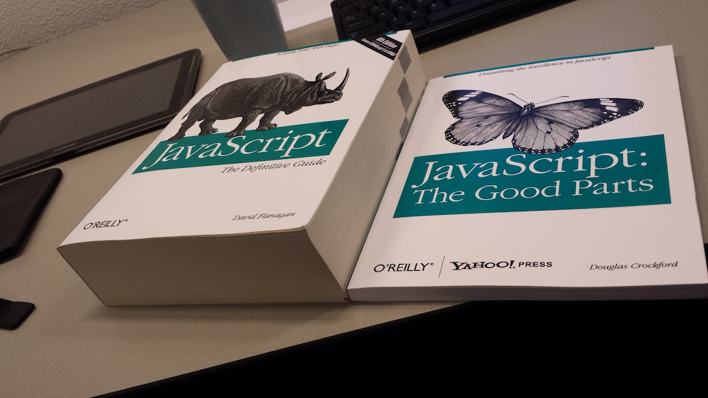
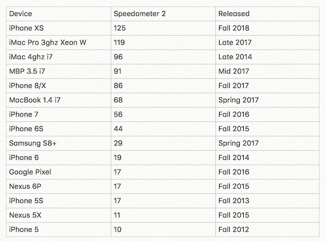
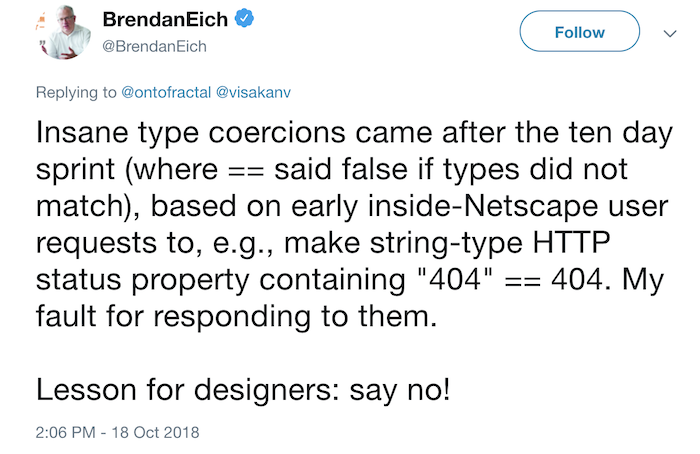
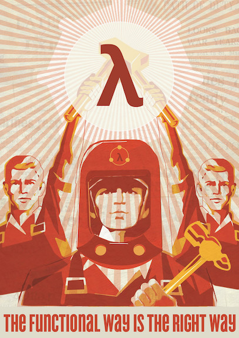

export {default as theme} from './theme'
import { Image, Appear } from 'mdx-deck'
import { Split } from 'mdx-deck/layouts'


#### gist: https://bit.ly/2OKyCDt

---
# Javascript :shit:

---

### WTF!?

```javascript
1 < 2 < 3            // -> true
3 > 2 > 1            // -> false

9007199254740992 + 1 // -> 9007199254740992

[4] * [4]            // -> 16
```

---

export default Split



### the good parts

---
### type coercion
```javascript
//explicit
Boolean(3) && true    // -> true

//implicit
'3' - 1               // -> 2
'3' + 1               // -> '31'
[1, 2, 3] + [4, 5, 6] // -> '1,2,34,5,6'
```

---
### strict equality operator
```javascript
'100' == 100  // -> true
'100' === 100 // -> false
```
---
### here be dragons
```javascript
[] == ''   // -> true
[] == 0    // -> true
[''] == '' // -> true
[0] == 0   // -> true
[0] == ''  // -> false
[''] == 0  // -> true
```
---
### numbers
<ul  style={{textAlign: 'left'}}>
    <li>double precision floating point numbers</li>
    <li>64 bits</li>
    <li>alternatives: decimal.js</li>
</ul>

```javascript
0.2 + 0.1 === 0.3 // -> false
```

---


---

---



---



---

### functional programming
<ul  style={{textAlign: 'left'}}>
    <li>pure functions</li>
    <li>higher-order functions</li>
    <li>immutability</li>
</ul>

---

# immutability

---

### variable declaration
<ul  style={{textAlign: 'left'}}>
    <li>var</li>
    <li>let</li>
    <li>const</li>
</ul>

---
### variable lifecycle
<ul  style={{textAlign: 'left'}}>
    <li>declaration</li>
    <li>initialization</li>
    <li>assignment</li>
</ul>

---
### var
```javascript
console.log(j); // -> ReferenceError: j is not defined
console.log(i); // -> undefined
var i = 0;
console.log(i); // -> 0
i = 2;
console.log(i); // -> 2
```
---
### var (scope)
```javascript
for(var o = 0; o < 5; o++) {
  //o is visible to the whole function
}
console.log(o); // -> 5
```
---
### let
```javascript
console.log(b); // -> ReferenceError: b is not defined
let b;
console.log(b); // -> undefined
b = 1;
console.log(b); // -> 1
b = 2;
console.log(b); // -> 2
```
---
### let (scope)
```javascript
for(let p = 0; p < 5; p++) {
  //p is visible to the block
}
console.log(p); // -> ReferenceError: p is not defined
```
---
### const
```javascript
console.log(c); // -> ReferenceError: c is not defined
const c;        // -> SyntaxError: Missing initializer
                //    in const declaration
const d = 1;
console.log(d); // -> 1
d = 2;          // -> TypeError: Assignment to constant
                //    variable.
```
---
### const (scope)
```javascript
const condition = true;
if (condition) {
  const l = 1;
}
console.log(l); // -> ReferenceError: l is not defined
```
---
### immutable array/object
```javascript
const values = Object.freeze([1,2,3,4]);
values[2] = 5;
console.log(values);          // -> [1, 2, 3, 4]

const laOne = Object.freeze({ firstName: 'Moria', age: 72 });
laOne.firstName = 'Susana';
console.log(laOne.firstName); // -> Moria
```

---

### spread operator (arrays)

```javascript
const values = [1,2];
const values2 = [9,10];

console.log([...values, 3]);
// -> [1,2,3]
console.log([...values, ...values2]);
// -> [1,2,9,10]
console.log([...values, 3, ...values2]);
// -> [1,2,3,9,10]
console.log(values);
// -> [1,2]
```

---

### spread operator (objects)

```javascript
const reservation = {
  airline: 'AA',
  from: 'EZE',
  to: 'LGW',
  depart: '2019-01-02'
};
console.log(reservation);
// -> {..., to: 'LGW'}
console.log({...reservation, to: 'LTN'});
// -> {..., to: 'LTN'}
console.log(reservation);
// -> {..., to: 'LGW'}
```

---

# functions

---
### parameters
```javascript
function whatever(a) {
  console.log(a);
}
whatever(5);    // -> 5
whatever();     // -> undefined
whatever(5,6);  // -> 5
```
---
### arguments object
```javascript
function max() {
  let large = arguments[0];
  for(let i = 0; i < arguments.length; i++) {
    if(arguments[i] > large) {
      large = arguments[i];
    }
  }
  return large;
}
console.log(max(4,6,2,1)); // -> 6
```
---
### rest parameter
```javascript
function max(...values) {
  return values.reduce((l, e) => l > e ? l : e, values[0]);
}
console.log(max(4,6,2,1)); // -> 6

function min(initial, ...values) {
  return values.reduce((m, e) => m > e ? e : m, initial);
}
const values = [4,6,2,1];
console.log(min(...values)); // -> 1
```
---
### default parameter
```javascript
function calculatePoints(price, ratio = 1) {
	return price * ratio;
}

calculatePoints(1000, 1.5); // -> 1500
calculatePoints(1000);      // -> 1000
```
---
### arrow function
```javascript
//anonymous functions
setTimeout(function() { console.log('hi!'); }, 2000);

//arrow functions
setTimeout(() => console.log('hi!'), 2000);

const sum = (n,m) => n + m;

const toUpperCase = s => s.toUpperCase();
```

---

# pure functions

---

### pure function
<ul  style={{textAlign: 'left'}}>
    <li>deterministic</li>
    <li>no side-effects</li>
</ul>

---
### impure functions
```javascript
//random is non deterministic
Math.random();

//side-effect
const addClassToBody = cn => document.body.className = cn;

//pure function
const sum = (a, b) => a + b;
```
---

# higher-order functions

---

### higher-order function
<ul  style={{textAlign: 'left'}}>
    <li>takes a function as an argument</li>
    <li>or returns a function</li>
</ul>

---
### higher-order functions
```javascript
const map = (xs, f) => {
  let index = -1
  const length = xs == null ? 0 : xs.length;
  const result = new Array(length);
  while (++index < length) {
    result[index] = f(xs[index],index);
  }
  return result;
};
map([1,2,3,4], x => x * 2); // -> [2,4,6,8]
const zipWith = (f, xs, ys) => map(xs, (n,i) => f(n, ys[i]));
zipWith(Math.pow, [1,2,3,4], [2,3,4,5]); // -> [1,8,81,1024]
```

---
### map
```javascript
const values = [2,6,9,11];
const ratio = Math.floor(Math.random()*(44-34+1)+34);
const usdValues = values.map(v => v * ratio);

const accommodations = [
  {name: 'Sheraton Buenos Aires', stars: 5},
  {name: 'Che Argentina Hostel', stars: 1}
];
accommodations.map(h => h.name);
// -> ['Sheraton Buenos Aires', 'Che Argentina Hostel']
```
---
### filter
```javascript
const accommodations = [
  {name: 'Sheraton Buenos Aires', hotelType: 'Hotel'},
  {name:'Che Argentina Hostel', hotelType: 'Hostel'},
  {name:'Urban 011', hotelType: 'Hostel'}
];
accommodations.filter(h => h.hotelType === 'Hotel');
// -> [{name: 'Sheraton Buenos Aires', hotelType: 'Hotel'}]
```
---
### reduce
```javascript
const values = [1,2,3,4,5];
values.reduce((acc, v) => acc + v, 0);
// -> 15

values.reduceRight((acc, v) => [...acc, v], []);
// -> [5, 4, 3, 2, 1]
```
---
### find
```javascript
const accommodations = [
  {name: 'Sheraton Buenos Aires', hotelType: 'Hotel'},
  {name:'Che Argentina Hostel', hotelType: 'Hostel'},
  {name:'Urban 011', hotelType: 'Hostel'}
];
accommodations.find(h => h.hotelType === 'Hostel');
// -> {name:'Che Argentina Hostel', hotelType: 'Hostel'}
accommodations.find(h => h.hotelType === 'B&B');
// -> undefined
```
---

# composition

---

### composition
```javascript
const compose = (...fns) =>
  fns.reduce((f, g) => (...args) => f(g(...args)));
const length = x => x.length;
const split = sep => s => s.split(sep);

const wordCount = compose(length, split(' '));

wordCount("Do not mutate state directly");
// -> 5
```

---
### composition
```javascript
[1,2,3,4,5].map(x => x * 2)
           .filter(x => x > 5);
//Going full Jorge Hané
[1,2,3,4,5].reduce((acc, x) => acc.concat(x * 2), [])
           .reduce((acc, x) => {
              return x > 5 ? acc.concat(x) : acc;
           }, []);

const mapReducer = f => (acc, x) => [...acc, f(x)];
const filterReducer = p => {
  return (acc, x) => p(x) ? [...acc, x] : acc;
}
```
---
### composition
```javascript
//Transducers
const mapT = f => reducer => (acc, x) => reducer(acc, f(x));
const filterT = p => reducer => {
  return (acc, x) => p(x) ? reducer(acc, x) : acc;
};

const concatReducer = (acc, x) => [...acc, x];
const double = mapT(x => x * 2);
const greaterThanFive = filterT(x => x > 5);
const exampleF = compose(double, greaterThanFive);
[1,2,3,4,5].reduce(exampleF(concatReducer), []);
```
---

- ramda: https://ramdajs.com/
- elm: https://elm-lang.org/
- purescript: http://www.purescript.org/
- Sejean c/Zaks de Sejean: https://bit.ly/2z8aRjLz
